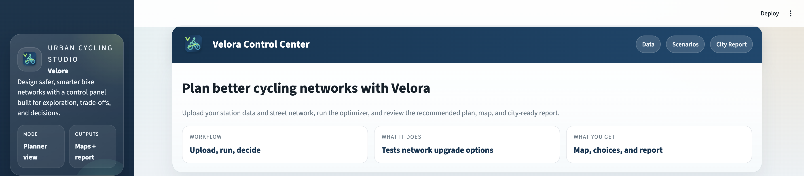
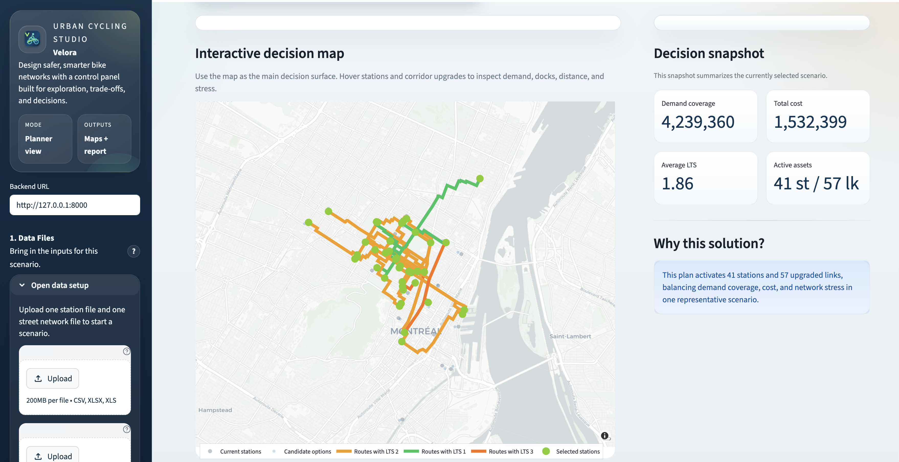
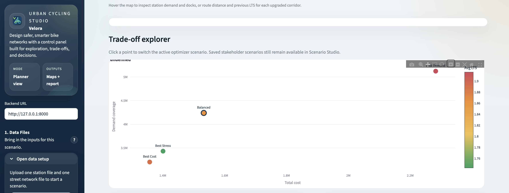

# Velora

Velora is a web-based planning platform for bike-share and cycling-infrastructure decisions. It helps planners upload station demand and street-network data, run a multi-objective optimizer, compare planning scenarios, and package recommendations for stakeholder review.

The repository is now organized as a software product first. The academic manuscript is retained in `Paper/`, but the main project surface is the Streamlit + FastAPI platform.



## What Velora Does

Velora turns station and street-network files into a scenario-comparison workspace:

- Generates candidate station alternatives around uploaded station locations.
- Builds a graph from the uploaded street network and LTS values.
- Runs an NSGA-II optimization over station selection and corridor upgrades.
- Extracts representative scenarios: `Balanced`, `Best Demand`, `Best Cost`, and `Best Stress`.
- Displays scenario results through a decision map, KPI snapshot, Pareto explorer, and comparison workspace.
- Estimates mode shift and emissions reduction potential from configurable assumptions.
- Saves runs and stakeholder scenarios for later review.
- Exports selected stations, links, and decision reports.

## Screenshots

### Interactive Decision Map



### Trade-Off Explorer



## Architecture

Velora runs as two local Python services:

```text
Streamlit frontend
  streamlit_app.py
        |
        | uploads files, starts jobs, polls status
        v
FastAPI backend
  backend_api.py
        |
        | runs optimization and stores payloads
        v
Optimization + persistence layer
  ui/optimizer.py
  ui/storage.py
  app_data/runs/<run_id>/
```

## Repository Layout

```text
.
├── streamlit_app.py              # Main Streamlit product UI
├── backend_api.py                # FastAPI job API and saved-run endpoints
├── ui/
│   ├── optimizer.py              # Data validation, graph building, NSGA-II, maps
│   ├── storage.py                # Saved run and scenario snapshot persistence
│   └── assets/                   # Velora logo assets
├── scripts/
│   ├── bixi_case_study_graphs.py # Case-study figure generation
│   └── notebooks/                # Python conversions of legacy notebooks
├── docs/
│   └── figures/                  # Product README screenshots
├── figures/
│   └── case_study/               # Case-study visual outputs
├── app_data/
│   └── runs/                     # Local saved optimization runs
├── Paper/                        # Manuscript and paper-only assets
├── verification_stations.csv     # Tiny local verification station dataset
├── verification_network.geojson  # Tiny local verification network
├── requirements-ui.txt           # Runtime dependencies
└── UI_README.md                  # Short UI-specific notes
```

## Quick Start

Create and activate a virtual environment:

```bash
python3 -m venv .venv
source .venv/bin/activate
```

Install dependencies:

```bash
pip install -r requirements-ui.txt
```

Start the backend:

```bash
uvicorn backend_api:app --host 127.0.0.1 --port 8000
```

Start the frontend in a second terminal:

```bash
streamlit run streamlit_app.py --server.port 8501
```

Open:

- Frontend: `http://127.0.0.1:8501`
- Backend health check: `http://127.0.0.1:8000/health`

## Input Data Contract

### Station File

Accepted formats:

- `.csv`
- `.xlsx`
- `.xls`

Required fields:

- `Station_Name`
- `Latitude`
- `Longitude`
- `Trips`

Optional field:

- `estimated_docks`

Supported aliases include:

- `station`, `name`, `station_name` -> `Station_Name`
- `lat`, `latitude` -> `Latitude`
- `lon`, `lng`, `longitude` -> `Longitude`
- `trips`, `total_trips`, `demand` -> `Trips`
- `docks`, `estimated_docks` -> `estimated_docks`

### Network File

Accepted formats:

- `.gpkg`
- `.geojson`
- `.json`
- `.shp`
- `.parquet`

Required fields:

- `geometry`
- `lts`

Optional field:

- `length`

If `length` is missing, Velora computes segment length from geometry.

## Main User Workflow

1. Upload station and network files.
2. Configure study area, cost, impact, network, and optimization assumptions.
3. Run optimization from the sidebar.
4. Inspect the decision map and five headline planning metrics.
5. Compare the active scenario against a baseline.
6. Save stakeholder-facing scenario snapshots with notes.
7. Export selected stations, selected links, or a generated decision report.

## Scenario Comparison

Velora is designed around scenario review, not just one optimization result. The current workspace supports:

- active scenario selection
- baseline scenario selection
- stakeholder scenario snapshots
- scenario notes
- demand, cost, LTS, mode-shift, and emissions comparisons
- map filtering by LTS and route length
- lightweight performance mode for larger networks

## Impact Assumptions

Velora estimates mode shift and emissions reduction from configurable sidebar assumptions:

```text
Mode shift potential = demand coverage * mode shift capture rate

Emissions reduction = shifted trips
                    * average shifted trip distance
                    * car emissions factor
```

These are planning estimates, not a full travel-demand model. They are included to make scenario trade-offs more legible for stakeholders.

## Backend API

### `GET /health`

Returns:

```json
{"status":"ok"}
```

### `POST /optimize`

Starts an asynchronous optimization job from uploaded station and network files plus configuration values.

Returns:

```json
{"job_id":"20260502-010636","status":"queued"}
```

### `GET /jobs/{job_id}`

Returns job progress and, once complete, the run payload.

### `GET /runs`

Lists saved runs.

### `GET /runs/{run_id}`

Returns a full saved run payload.

## Saved Data

Saved runs are stored locally under:

```text
app_data/runs/<run_id>/
```

Each run contains:

- `summary.json`
- `pareto.json`
- `pareto_rows.csv`
- `map_*.json`
- `stations_*.csv`
- `links_*.csv`
- optional `scenario_snapshots.json`

For deployment, treat `app_data/runs/` as local application state. In a hosted setup, this should move to persistent object storage or a database.

## Legacy Notebook Conversions

The old exploratory notebooks have been converted into Python scripts under:

```text
scripts/notebooks/
```

These files preserve the notebook cells as script sections for reference and migration. The production app logic lives in `streamlit_app.py`, `backend_api.py`, and `ui/`.

## Development Notes

Recommended checks:

```bash
python -m py_compile streamlit_app.py backend_api.py ui/optimizer.py ui/storage.py
python -m py_compile scripts/notebooks/*.py
```

The app is intentionally split into:

- Streamlit for the planning interface
- FastAPI for job orchestration
- `ui/optimizer.py` for reusable optimization logic
- `ui/storage.py` for saved runs and scenario snapshots

## Deployment Notes

For a simple hosted deployment:

- Deploy `backend_api.py` with Uvicorn on Render, Railway, or another Python web service.
- Deploy `streamlit_app.py` on Streamlit Community Cloud, Render, or another Streamlit-compatible host.
- Set the frontend backend URL to the public backend service.

For production use, add:

- environment-based backend URL configuration
- persistent storage for `app_data/runs`
- authentication if multiple users or private datasets are involved
- input-size limits and job timeout policies

## Paper Folder

`Paper/` is retained for the manuscript, references, and paper-specific figures. It is not required to run Velora as a platform.

